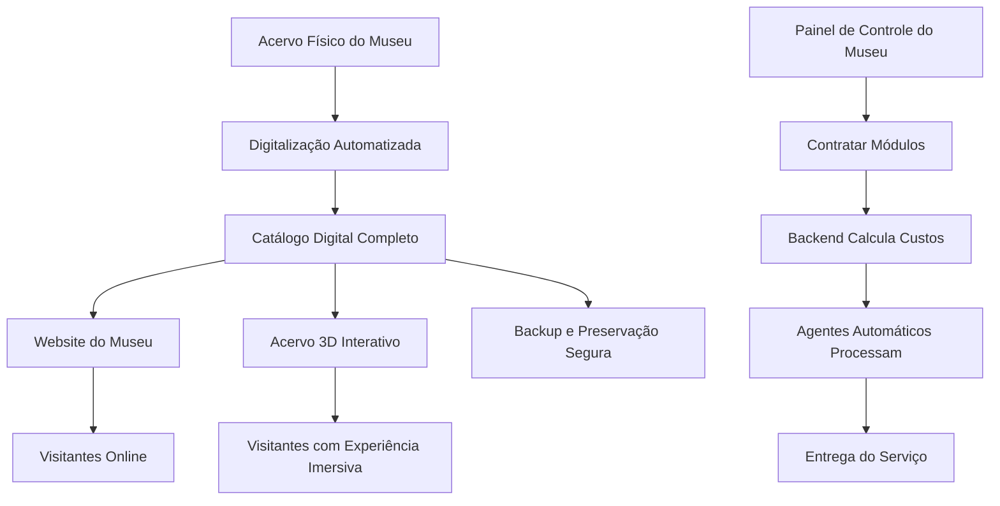

# 🏛️ MUSA© - Museu Digital 3D - Design Document (Versão Público Geral)

## Sumário Executivo

O **MUSA© - Museu Digital 3D** é um serviço inovador que transforma a forma como museus gerenciam, preservam e exibem seu acervo. Nossa plataforma combina tecnologia de ponta com simplicidade, oferecendo uma solução modular e escalável que permite que museus de todos os tamanhos tenham uma presença digital impressionante e interativa, com custos transparentes e previsíveis. A plataforma inclui assistentes de IA conversacionais integrados, capazes de responder perguntas sobre o acervo tanto no frontend web quanto em quiosques físicos com reconhecimento de fala.

---

## 🌟 O Problema

### Os Desafios dos Museus Hoje

Museus enfrentam diversos desafios no mundo digital:

1. **Preservação Física** - Acervos estão vulneráveis a incêndios, roubos, desastres naturais e deterioração natural
2. **Acesso Limitado** - Apenas visitantes presenciais podem apreciar as peças
3. **Gestão Complexa** - Catalogar milhares de peças manualmente é lento e sujeito a erros
4. **Digitalização Cara** - Criar presença online profissional exige investimentos que muitos museus não podem fazer
5. **Engajamento do Público** - Visitantes modernos esperam experiências interativas e imersivas

### A Oportunidade

Com a tecnologia atual, podemos:
- Criar **cópias digitais perfeitas** de cada peça
- Tornar o acervo **acessível globalmente** 24/7
- Automatizar o processo de catalogação
- Oferecer **experiências 3D interativas** que encantam visitantes
- Preservar digitalmente o patrimônio cultural para sempre

---

## 💡 Nossa Solução

### O Que Oferecemos

O **MUSA© - Museu Digital 3D** é um serviço completo que inclui:

1. **Catalogação Inteligente** - Digitalização automática do acervo usando inteligência artificial
2. **Website Personalizado** - Um site profissional e moderno para cada museu
3. **Acervo 3D Interativo** - Visualização imersiva das peças em três dimensões
4. **Assistente IA conversacionais** - Tanto no website frontend quanto em quiosques físicos e mobile app.
5. **Backup e Preservação** - Armazenamento seguro em nuvem e em servidores locais
6. **Gestão Simplificada** - Painel administrativo fácil de usar
7. **Arquitetura Modular** - Museus contratam apenas o que precisam, quando precisam

### Como Funciona

---

## 🎯 Nossos Serviços por Níveis (Tiers)

### Tier Bronze - 🥉 "Museu Digital"

**Público:** Museus pequenos começando sua jornada digital

**O Que Inclui:**
- ✅ Website completo e responsivo do museu
- ✅ Catálogo digital com fotos em alta qualidade
- ✅ Sistema de busca e filtros por coleção/período
- ✅ Fichas técnicas detalhadas de cada peça
- ✅ Backup automático em nuvem
- ✅ Painel administrativo para atualizações

**Ideal para:** Museus comunitários, pequenas galerias, coleções particulares

---

### Tier Silver - 🥈 "Museu Interativo"

**Público:** Museus médios querendo se destacar

**Tudo do Bronze +:**
- ✅ **Escolha das "Peças Heroicas"** (até 50 peças selecionadas)
- ✅ **Modelos 3D interativos** das peças escolhidas
- ✅ **Experiência "Exploded View"** - peças se separam para mostrar detalhes
- ✅ Visualização em realidade aumentada (AR) pelo celular
- ✅ Galerias virtuais temáticas
- ✅ Importação automática de novas peças via OCR

**Ideal para:** Museus históricos, museus de arte, galerias regionais

---

### Tier Gold - 🏆 "Museu Imersivo"

**Público:** Grandes museus, instituições de prestígio

**Tudo do Silver +:**
- ✅ **Digital Twin Completo** - réplica digital exata do museu físico
- ✅ **Todos os modelos 3D** do acervo
- ✅ **Visita Virtual Guiada** - tour interativo com narração
- ✅ **Salas Interativas** - cenários 3D imersivos
- ✅ **Streaming de Alta Performance** - experiência fluida mesmo em dispositivos simples
- ✅ **Integração com Displays Físicos** - conteúdo digital para quiosques no museu
- ✅ **Exportação de Dados** para arquivamento permanente

**Ideal para:** Grandes museus nacionais, instituições culturais importantes

---

## 📦 Módulos do Serviço

### 1. 📸 Digitalização e Catalogação (One-Time)

**O que é:** Processo completo de transformar o acervo físico em dados digitais.

**Inclui:**
- Fotografia/escaneamento das peças
- OCR das fichas catalográficas
- IA para corrigir e estruturar os dados
- Criação de modelos 3D (conforme tier escolhido)
- Importação automática no sistema

**Preço Base:** A partir de R$ 470 por objeto (escaneamento 3D profissional)

**Prazo:** 2-4 semanas para acervos de até 5.000 peças

---

### 2. 🎨 Frontend Personalizado (One-Time)

**O que é:** Website único, com a identidade visual do museu.

**Inclui:**
- Design customizado do site
- Integração com o catálogo
- Configuração de domínio e hospedagem
- Otimização para SEO e dispositivos móveis

**Preço Base:** A partir de R$ 5.000 (projetos simples) até R$ 25.000+ (projetos complexos)

---

### 3. 🏛️ Hospedagem e Manutenção (Mensal)

**O que é:** Infraestrutura em nuvem para manter o site e o acervo online.

**Inclui:**
- Servidor web e banco de dados
- Armazenamento em nuvem para fotos e modelos 3D
- Backups automáticos
- Atualizações de segurança
- Suporte técnico

**Preço Base:** A partir de R$ 120/mês para sites simples

**Custo de Armazenamento:** ~R$ 0,09 por GB/mês para armazenamento padrão

---

### 4. 🎮 Modelos 3D Interativos (One-Time + Mensal)

**O que é:** Transformar peças selecionadas em modelos 3D interativos.

**Inclui:**
- Modelagem 3D profissional
- Otimização para web (formato GLB)
- Configuração para visualização interativa
- Armazenamento e streaming dos modelos

**Preço Base (por peça):**
- **Scan 3D (on-site):** A partir de R$ 470 por objeto
- **Touch-up 3D + Upload:** ~R$ 100 por objeto

**Custo de Armazenamento:** Cada modelo 3D ocupa aproximadamente 5-50 MB após otimização. Para um acervo médio de 5.000 peças com 10% em 3D (500 modelos), o espaço necessário é de 2,5-25 GB, custando R$ 0,23-2,25/mês em armazenamento.

---

### 5. 🏛️ Digital Twin do Museu (One-Time + Mensal)

**O que é:** Réplica digital 3D completa do espaço físico do museu.

**Inclui:**
- Escaneamento 3D das alas e salas
- Posicionamento das peças no espaço virtual
- Experiência imersiva de visita guiada
- Otimização para streaming

**Preço Base:** A partir de R$ 2.500 (para 80 objetos em 3D, voo e hospedagem inclusos)

**Custo de Streaming:** Depende do tráfego de dados. Planilhe ~R$ 0,09 por GB de dados transferidos.

---

## 💰 Modelo de Precificação Detalhada

### Estimativa de Custos por Tamanho de Acervo

#### Metodologia de Cálculo

Baseado em dados do ICOM, museus têm tamanhos de acervo variados:

| Tamanho do Acervo | % dos Museus | Exemplo de Uso |
|-------------------|--------------|----------------|
| < 1.000 peças | ~7-9% | Museus comunitários |
| < 5.000 peças | ~12-25% | Museus de arte regionais |
| 5.000-20.000 peças | ~12-18% | Museus históricos médios |
| 20.000-100.000 peças | ~13-24% | Grandes museus |
| > 500.000 peças | ~10% | Mega-museus como o British Museum |

#### Exemplo 1: Museu Pequeno (1.000 peças, 10% em 3D)

| Item | Cálculo | Valor |
|------|---------|-------|
| **One-Time** | | |
| Digitalização 2D das 1.000 peças | ~R$ 10/peça | R$ 10.000 |
| Modelos 3D (100 peças) | R$ 470/peça | R$ 47.000 |
| Frontend Personalizado | Pacote básico | R$ 5.000 |
| **Total One-Time** | | **R$ 62.000** |
| **Mensal** | | |
| Hospedagem (site + dados) | 50 GB | R$ 120/mês |
| Armazenamento 3D (100×10MB) | 1 GB | R$ 0,09/mês |
| Suporte e manutenção | Tier básico | R$ 200/mês |
| **Total Mensal** | | **R$ 320,09/mês** |

---

#### Exemplo 2: Museu Médio (5.000 peças, 10% em 3D)

| Item | Cálculo | Valor |
|------|---------|-------|
| **One-Time** | | |
| Digitalização 2D das 5.000 peças | ~R$ 5/peça (em lote) | R$ 25.000 |
| Modelos 3D (500 peças) | R$ 470/peça | R$ 235.000 |
| Frontend Personalizado | Pacote intermediário | R$ 15.000 |
| **Total One-Time** | | **R$ 275.000** |
| **Mensal** | | |
| Hospedagem (site + dados) | 200 GB | R$ 350/mês |
| Armazenamento 3D (500×20MB) | 10 GB | R$ 0,90/mês |
| Suporte e manutenção | Tier prata | R$ 500/mês |
| **Total Mensal** | | **R$ 850,90/mês** |

---

#### Exemplo 3: Grande Museu (50.000 peças, 20% em 3D)

| Item | Cálculo | Valor |
|------|---------|-------|
| **One-Time** | | |
| Digitalização 2D das 50.000 peças | ~R$ 2/peça (em lote) | R$ 100.000 |
| Modelos 3D (10.000 peças) | R$ 470/peça | R$ 4.700.000 |
| Frontend Personalizado | Pacote premium | R$ 50.000 |
| Digital Twin do Museu | Pacote completo | R$ 25.000 |
| **Total One-Time** | | **R$ 4.875.000** |
| **Mensal** | | |
| Hospedagem (site + dados) | 1 TB | R$ 1.500/mês |
| Armazenamento 3D (10.000×30MB) | 300 GB | R$ 27/mês |
| Streaming de Digital Twins | Estimado 1 TB/mês | R$ 90/mês |
| Suporte e manutenção | Tier ouro | R$ 2.000/mês |
| **Total Mensal** | | **R$ 3.617/mês** |

---

### Precificação Mensal por Módulo (para o Cliente)

#### Pacote Base (Obrigatório)

| Módulo | Preço Mensal | Inclui |
|--------|--------------|--------|
| **Hospedagem Essencial** | R$ 299 | Site, catálogo 2D, 10 GB de armazenamento |
| **Manutenção Básica** | R$ 199 | Atualizações de segurança, backups diários |
| **Suporte Nível 1** | R$ 99 | Suporte por email, 24h de resposta |

#### Módulos Adicionais

| Módulo | Preço Mensal | Descrição |
|--------|--------------|-----------|
| **Armazenamento Extra** | R$ 0,90/GB | Espaço adicional para modelos 3D |
| **Modelos 3D (ativação)** | R$ 100/mês | Habilita visualização 3D no site |
| **Novas Peças em 3D** | R$ 470/peça | Scan e modelagem de novas peças (one-time) |
| **Tour Virtual** | R$ 500/mês | Visita guiada 3D interativa |
| **Digital Twin** | R$ 2.000/mês | Réplica 3D do museu + streaming |
| **Quiosques Físicos** | R$ 300/mês | Sincronização com displays no museu |
| **API Exportação** | R$ 400/mês | Exportação de dados para sistemas externos |

---

### Exemplos de Pacotes para o Cliente

#### 🥉 Bronze - "Museu Digital"
**Preço:** R$ 597/mês

| Item | Custo |
|------|-------|
| Hospedagem Essencial | R$ 299 |
| Manutenção Básica | R$ 199 |
| Suporte Nível 1 | R$ 99 |
| **Total** | **R$ 597/mês** |

**Ideal para:** Museus com até 1.000 peças, apenas catálogo 2D

---

#### 🥈 Silver - "Museu Interativo"
**Preço:** R$ 1.197/mês (inclui 10 modelos 3D ativos)

| Item | Custo |
|------|-------|
| Hospedagem Essencial | R$ 299 |
| Manutenção Básica | R$ 199 |
| Suporte Nível 1 | R$ 99 |
| Modelos 3D (ativação) | R$ 100 |
| Armazenamento Extra (5 GB) | R$ 4,50 |
| 10 Modelos 3D/mês | R$ 4.700 (one-time) |
| **Total Mensal** | **R$ 1.197/mês** |
| **Total One-Time** | **R$ 4.700** |

**Ideal para:** Museus com até 5.000 peças, querendo destacar peças em 3D

---

#### 🥇 Gold - "Museu Imersivo"
**Preço:** R$ 3.197/mês (pacote completo)

| Item | Custo |
|------|-------|
| Hospedagem Essencial | R$ 299 |
| Manutenção Básica | R$ 199 |
| Suporte Nível 1 | R$ 99 |
| Modelos 3D (ativação) | R$ 100 |
| Tour Virtual | R$ 500 |
| Digital Twin | R$ 2.000 |
| **Total Mensal** | **R$ 3.197/mês** |

**Ideal para:** Grandes museus com mais de 10.000 peças, experiência imersiva completa

---

## 🛠️ Nossa Tecnologia

### Ferramentas que Usamos

| Tecnologia | Para Quê? | Vantagem |
|------------|-----------|----------|
| **Tainacan** | Gerenciamento do acervo | Sistema profissional, gratuito, testado, com API REST completa |
| **OpenUSD** | Modelos 3D interativos | Padrão da indústria (Pixar), flexível |
| **IA/OCR** | Catalogação automática | Digitalização rápida, barata, precisa |
| **Web 3D (Three.js/WebGL)** | Visualização online | Funciona em qualquer navegador |
| **Omniverse** | Streaming 3D de alta qualidade | Imagens realistas em qualquer dispositivo |
| **AWS S3 / Azure Blob** | Armazenamento em nuvem | Escalável, durável (11 noves de durabilidade) |

### Nossa Diferenciação

1. **Pipeline Automatizada de Catalogação**
   - Fotos das fichas → OCR → IA corrige e organiza → Sistema preenchido
   - **Resultado:** Dias de trabalho viram horas

2. **Asset Watertight**
   - Cada peça é um "arquivo inteligente" que contém toda sua informação
   - Pode ser atualizado, expandido e integrado facilmente
   - **Resultado:** Facilidade de manutenção e evolução

3. **Arquitetura Modular**
   - Museus contratam apenas o que precisam
   - Backend calcula custos automaticamente
   - Agentes automatizados processam demandas
   - **Resultado:** Transparência e escalabilidade

4. **Sistema de Importação Flexível**
   - Tainacan suporta importação em lote de CSV, XLSX e JSON
   - API REST completa para integração
   - Metadados personalizáveis por coleção

---

## 📋 Como Funciona a Contratação de Módulos

### Fluxo do Cliente

1. **Museu acessa o Painel de Controle**
   - Visualiza módulos disponíveis
   - Vê custos estimados

2. **Seleciona os Módulos Desejados**
   - Exemplo: "Quero adicionar 10 modelos 3D este mês"

3. **Backend Calcula Custos**
   - Baseado em preços dos provedores de nuvem
   - Inclui margem de lucro

4. **Sistema Gera Tarefa Automática**
   - Cria "entry" na fila de demandas pendentes
   - Notifica agentes automatizados

5. **Agentes Processam a Demanda**
   - Escaneadores recebem a solicitação
   - Modelagem 3D é iniciada
   - Dados são importados automaticamente

6. **Cliente Recebe Notificação**
   - "Seus 10 novos modelos 3D estão prontos!"

---

## 🎯 Benefícios para o Museu

### Para a Gestão

- **Economia de Tempo:** Catalogação automática reduz meses de trabalho
- **Redução de Custos:** Elimina necessidade de equipe de TI dedicada
- **Segurança:** Backup automático protege o patrimônio
- **Facilidade:** Sistema intuitivo que não requer treinamento extensivo
- **Transparência:** Custos claros e previsíveis

### Para os Visitantes

- **Acesso Global:** Seu acervo disponível para o mundo todo
- **Experiência Imersiva:** Explore peças em 3D como nunca antes
- **Educação:** Aprendizado interativo e envolvente
- **Conveniência:** Visite o museu de qualquer lugar, a qualquer hora

### Para o Patrimônio Cultural

- **Preservação Digital:** Cópias seguras mesmo em caso de desastre
- **Documentação Completa:** Todos os metadados preservados
- **Compartilhamento:** Facilita colaboração entre instituições
- **Futuro:** Formatos abertos garantem compatibilidade futura

---

## 🚀 Nosso Diferencial

### Por Que Escolher a Gente?

1. **Abordagem Holística** - Não só fazemos o website, criamos todo o ecossistema digital
2. **Tecnologia de Ponta** - Usamos o que há de melhor (OpenUSD, Omniverse)
3. **Preço Acessível** - Soluções que cabem no orçamento de museus de todos os tamanhos
4. **Visão de Futuro** - Arquitetura que permite crescer e evoluir
5. **Paixão pelo Patrimônio** - Entendemos a importância cultural do seu acervo
6. **Modelo Modular** - Pague apenas pelo que precisa, expanda quando quiser
7. **Transparência Total** - Custos baseados em preços reais de provedores de nuvem

---

## 📋 Próximos Passos

### Como Começar

1. **Diagnóstico Inicial** (1 semana)
   - Entendemos seu acervo e necessidades
   - Planejamos a digitalização
   - Calculamos custos personalizados

2. **Digitalização** (2-4 semanas)
   - Fotografamos/escaneamos as peças
   - Processamos com IA
   - Criamos modelos 3D (quando aplicável)

3. **Configuração do Sistema** (1-2 semanas)
   - Instalamos e customizamos o website
   - Configuramos o catálogo digital
   - Testamos tudo

4. **Treinamento e Lançamento** (1 semana)
   - Treinamos sua equipe
   - Lançamos oficialmente
   - Suporte contínuo

### Entrega Final

- ✅ Website completo do museu
- ✅ Catálogo digital totalmente preenchido
- ✅ Modelos 3D (conforme tier escolhido)
- ✅ Painel administrativo
- ✅ Backup automatizado
- ✅ Manual do usuário
- ✅ 30 dias de suporte pós-lançamento

---

## 💎 Conclusão

O **MUSA© - Museu Digital 3D** não é apenas um serviço de website - é uma revolução na forma como museus se conectam com o mundo. Combinando tecnologia de ponta com simplicidade, oferecemos uma solução completa que preserva o passado, engaja o presente e prepara o futuro.

Nossa abordagem modular e transparente garante que museus de todos os tamanhos possam participar da revolução digital, pagando apenas pelo que precisam e expandindo conforme crescem. Com custos baseados em preços reais de provedores de nuvem, oferecemos um serviço sustentável, justo e escalável.

**Junte-se a nós na preservação digital do patrimônio cultural!**

---

**📞 Contato para mais informações:**
- Email: [seu-email]
- Telefone: [seu-telefone]
- Website: [seu-website]

---

*"Preservando o passado, construindo o futuro."*

---------------------------------------------------------------------------------------------------------------------