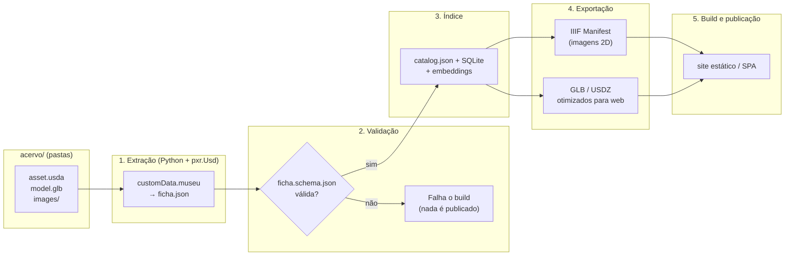

O documento abaixo considera o usd como base para os digital twins online. Isso vai depender da viabilidade de implementação, no início,
já que ainda é preciso testar a conversão de usd para web assembly, e webGL já funciona no momento normalmente. Então, ao ler
considere que talvez seja uma implementação para ser testada mais adiante.
A vantagem da implementação dos digital twins (peças do acervo e alas inteiras de um museu) em usd tem ganhos consideráveis ao suportar
payloads/references (nesting de stages/cenas) e a natureza modular e extensível do formato usd, bom também para lookdev, mas requer
um tanto mais recursos e essa fase de testes da pipeline usd -> web assembly, já que browsers não suportam usd nativamente, e o 
frontend do serviço é um website/webUI.

---------------------------------------------------------------------------------------------------------------------

# 🔧 MUSA — Implementação: o asset USD

> **Documento de implementação.** Complementa a especificação técnica
> (`docs/Musa_design document_technical-specs_v1.1.md`), detalhando §2.2 (modelagem 3D),
> §2.3 (pipeline) e §3.1 (asset watertight). Consolidado em 2026-09-16 a partir das
> sessões de design — ver `docs/adr/`.

---

## 1. Papel de cada formato

| Papel | Formato | Obrigatório? |
|-------|---------|--------------|
| Fonte do asset 3D: geometria, aparência, variantes, animações, anotações | `.usda` / `.usdc` | **não no MVP** |
| Metadados curadoriais legíveis por máquina | `ficha.json` (contrato §3.2) | **sim** |
| Entrega web | `.glb` | **sim**, quando `model_status = available` |
| Arquivamento e intercâmbio | `.usd` + `.usdz` | opcional (tier premium) |

O **MVP pode ser GLB-only**: uma `ficha.json` escrita à mão (ou gerada pelo pipeline de OCR)
mais um `model.glb`. Quando o USD entra no fluxo, ele passa a ser a **fonte** e a `ficha.json`
torna-se **derivada** dele — nunca mantida em paralelo à mão, para não haver duas verdades.

`ficha.json` ↔ chaves: os nomes de campo do `customData` do USD espelham exatamente o
`schemas/ficha.schema.json`. O script de extração é burro de propósito: ele apenas move o
dicionário, e a validação do contrato pega o resto.

---

## 2. Estrutura de pastas do acervo

```
acervo/
├── colecao_egipcia/
│   ├── metadata.usd               # Metadados da coleção
│   ├── vaso_canopo/
│   │   ├── asset.usda             # Fonte do asset: modelo + ficha + referências
│   │   ├── ficha.json             # DERIVADA do asset.usda (ou escrita à mão no MVP)
│   │   ├── model.glb              # Entrega web (payload referenciado pelo USD)
│   │   ├── textures/
│   │   │   ├── base_color.png
│   │   │   └── normal_map.png
│   │   └── images/                # Imagens 2D (referenciadas pelo USD)
│   │       ├── front.jpg
│   │       ├── side.jpg
│   │       └── detail.jpg
│   │
│   └── sarcofago/
│       ├── asset.usda
│       ├── model.glb
│       └── images/
│
├── colecao_grega/
│   └── anfora/
│       ├── asset.usda
│       └── ...
│
└── alas/                          # Digital twins de áreas do museu
    ├── ala_egipcia.usda           # Layout da ala, com referências às peças
    ├── robo_guia.usda             # Assistente in loco (ver §6.4)
    └── display_interativo.usda
```

Regra: **tudo que pertence a uma peça vive na pasta da peça.** A pasta é a unidade de
empacotamento, o que torna cada peça copiável, versionável e substituível isoladamente.

---

## 3. O asset watertight (`asset.usda`)

A interface pública do asset é o `customData` do seu **prim raiz (default prim)**. O interior
(geometria, variantes, animações, labels) é detalhe privado — do lado de fora só se vê a ficha.

```usda
#usda 1.0
# Single source of truth for the item "vaso_canopo".
# The public interface is customData.museu on the default prim: it mirrors
# schemas/ficha.schema.json one-to-one.

def Xform "vaso_canopo" (
    customData = {
        dictionary museu = {
            # --- Contract fields (mirror ficha.schema.json) ---
            string asset_id = "EG-001"
            string titulo = "Vaso Canopo com Cabeça de Falcão"
            string autor = "Desconhecido"
            string data = "-650"
            string material = "Alabastro"
            string dimensoes = "45cm x 18cm x 18cm"
            string descricao = "Vaso canopo para vísceras mumificadas, representando o deus Qebehsenuef."
            string colecao = "colecao_egipcia"
            string[] tags = ["religiao", "mumificacao", "deuses_egipcios", "VII_seculo_AC"]

            # --- Delivery (filled by the pipeline, not by hand) ---
            string model_primary = "model.glb"
            string model_source = "asset.usda"
            string[] model_formats = ["glb", "usda"]
            string model_viewer = "three_js"
            string model_status = "available"

            # --- Non-contract extras: free-form, ignored by validation ---
            dictionary localizacao = {
                string ala = "Ala Egípcia"
                string vitrine = "Vitrine 12"
                string numero_inventario = "MUS-2024-001"
            }
            dictionary apresentacao = {
                string prioridade = "alta"
                bool rotacao_3d = true
                bool zoom = true
                string preview_imagem = "images/front.jpg"
            }
        }
    }
)
{
    # --- 3D model: the GLB is a payload, loaded only when needed ---
    def "Modelo" (
        payload = @model.glb@
    ) {
        customData = {
            dictionary modelo_info = {
                string formato = "glb"
                int vertices = 24500
                int faces = 12300
            }
        }
    }

    # --- Presentation variants: the viewer switches, the data does not change ---
    variants "vis" (
        variants = {
            "default" = { def Xform "Default" {} }
            "exploded" = {
                def Xform "Exploded" {
                    double3 xformOp:translate = (0, 0.5, 0)
                    uniform token[] xformOpOrder = ["xformOp:translate"]
                }
            }
            "sectioned" = { def Xform "Sectioned" {} }
        }
    )
    {
        # Variant sets are declared per-prim; the pipeline publishes the names it finds
        # so the frontend can render the switcher without hard-coding them.
    }

    # --- 2D images: referenced by the IIIF manifest generator (§5.2) ---
    def "Imagens" {
        customData = {
            dictionary imagens = {
                string front = "images/front.jpg"
                string side = "images/side.jpg"
                string detail = "images/detail.jpg"
            }
        }
    }

    # --- Annotations: clickable points in the 3D view ---
    def Scope "Labels" {
        def Xform "Label_Boca" {
            double3 xformOp:translate = (0.5, 1.2, 0)
            customData = {
                string label = "Boca do vaso"
                string descricao = "Abertura para inserção das vísceras"
            }
        }
    }

    # --- Behaviour: consumed by the viewer, not by the data layer ---
    def Scope "Animations" {
        customData = {
            dictionary animacao = {
                bool ativo = true
                float velocidade = 0.02
                string eixo = "y"
                bool loop = true
            }
        }
    }
}
```

**Por que `payload` e não `references`:** um payload pode ser descarregado. O visitante que só
quer ver a ficha não paga o custo do GLB; quem entra no viewer 3D o carrega. Em uma ala inteira
com dezenas de peças, isso é a diferença entre abrir e não abrir.

---

## 4. Metadados da coleção (`metadata.usd`)

Uma pasta de primeiro nível em `acervo/` é uma coleção. O arquivo de metadados da coleção não
carrega asset — ele descreve a pasta e lista seus itens.

```usda
#usda 1.0
# Collection-level metadata. Carries no geometry: it describes the folder and its items.

def Xform "colecao_egipcia" (
    customData = {
        dictionary museu = {
            string colecao = "colecao_egipcia"
            string titulo = "Coleção Egípcia"
            string descricao = "Acervo de artefatos do Antigo Egito, de 3000 a.C. a 30 d.C."
            string cor_primaria = "#D4A574"
            string icone = "pyramid.svg"
            dictionary configuracao = {
                bool viewer_3d_padrao = true
                string ordem_exibicao = "cronologica"
            }
            string[] itens = [
                "vaso_canopo/asset.usda",
                "sarcofago/asset.usda",
            ]
        }
    }
)
{
}
```

> `itens` é **redundante por design**: a pasta é a fonte da lista. O campo existe como
> conveniência de leitura. O scanner sempre reconcilia a lista contra o disco e reporta
> divergências como erro de build, em vez de confiar no arquivo.

---

## 5. Pipeline



A validação é o portão: um asset só é publicado se a ficha derivada passar no contrato. Isso é
o que dá sentido ao termo "watertight" — não é uma promessa, é uma checagem que quebra o build.

### 5.1 `scripts/extract_metadata.py`

```python
"""Extract ficha.json from the USD assets of the collection."""

import json
from pathlib import Path

from jsonschema import validate
from pxr import Usd

SCHEMA = json.loads(Path("schemas/ficha.schema.json").read_text(encoding="utf-8"))
MUSEU_KEY = "museu"
COLLECTION_FILE = "metadata.usd"


def extract(usda_path: Path) -> dict:
    """Read customData.museu from the default prim of a USD asset."""
    stage = Usd.Stage.Open(str(usda_path))
    default_prim = stage.GetDefaultPrim()
    if not default_prim:
        raise ValueError(f"{usda_path}: no default prim declared")

    raw = default_prim.GetCustomData()
    ficha = raw.get(MUSEU_KEY)
    if ficha is None:
        raise ValueError(f"{usda_path}: customData.{MUSEU_KEY} is missing")

    # Sdf values come back wrapped; unwrap to plain Python before validating.
    return {k: unwrap(v) for k, v in ficha.items()}


def unwrap(value):
    """Return a plain Python value from an Sdf value or Vt array."""
    if hasattr(value, "items"):
        return {k: unwrap(v) for k, v in value.items()}
    if isinstance(value, (list, tuple)):
        return [unwrap(v) for v in value]
    return value


def build(acervo_root: Path) -> list[dict]:
    """Walk acervo/, extract every item and validate it against the contract."""
    items = []
    for usda_path in sorted(acervo_root.rglob("*.usd*")):
        if usda_path.name == COLLECTION_FILE:
            continue

        ficha = extract(usda_path)
        validate(instance=ficha, schema=SCHEMA)

        # Persist the derived record next to its asset.
        out = usda_path.with_name("ficha.json")
        out.write_text(json.dumps(ficha, ensure_ascii=False, indent=2), encoding="utf-8")
        items.append(ficha)

    return items


if __name__ == "__main__":
    build(Path("acervo"))
```

### 5.2 `scripts/generate_iiif.py`

Gera um IIIF **Presentation API 3.0** Manifest por item, usando as imagens declaradas no USD.
Ver a nota de escopo em §10: o IIIF cobre as imagens 2D, e **não** cobre 3D.

```python
"""Generate IIIF Presentation API 3.0 manifests from the item USD records."""

import json
from pathlib import Path

IMAGE_FORMATS = {
    ".jpg": "image/jpeg",
    ".jpeg": "image/jpeg",
    ".png": "image/png",
    ".webp": "image/webp",
}
CONTEXT = "http://iiif.io/api/presentation/3/context.json"


def build_manifest(ficha: dict, base_url: str, item_dir: str) -> dict:
    """Build a single-item IIIF manifest from a validated record."""
    item_id = ficha["asset_id"]
    images = ficha.get("imagens", {})

    canvases = []
    for index, (label, relative_path) in enumerate(sorted(images.items())):
        canvas_id = f"{base_url}/iiif/{item_id}/canvas/{index}"
        canvases.append({
            "id": canvas_id,
            "type": "Canvas",
            "label": {"en": [label]},
            "items": [{
                "id": f"{canvas_id}/page",
                "type": "AnnotationPage",
                "items": [{
                    "id": f"{canvas_id}/annotation",
                    "type": "Annotation",
                    "motivation": "painting",
                    "body": {
                        "id": f"{base_url}/acervo/{item_dir}/{relative_path}",
                        "type": "Image",
                        "format": IMAGE_FORMATS.get(Path(relative_path).suffix.lower(), "image/jpeg"),
                    },
                    "target": canvas_id,
                }],
            }],
        })

    return {
        "@context": CONTEXT,
        "id": f"{base_url}/iiif/{item_id}/manifest.json",
        "type": "Manifest",
        "label": {"pt": [ficha["titulo"]]},
        "summary": {"pt": [ficha.get("descricao", "")]},
        "metadata": [
            {"label": {"pt": ["Cultura"]}, "value": {"none": [ficha.get("cultura", "")]}},
            {"label": {"pt": ["Material"]}, "value": {"none": [ficha.get("material", "")]}},
            {"label": {"pt": ["Data"]}, "value": {"none": [ficha.get("data", "")]}},
        ],
        "items": canvases,
    }
```

---

## 6. Frontend

### 6.1 Ler os metadados no navegador

Há duas famílias de solução, e a escolha depende do tier:

| Abordagem | Biblioteca | Quando |
|-----------|------------|--------|
| Ler o USD no browser | `@loaders.gl/usdz` (USDLoader) | precisa das variantes e anotações vindas do próprio USD |
| Renderizar USD como cena | `@needle-tools/usd` (WASM), `USDZLoader` do Three.js | digital twins e cenas compostas |
| **Não ler USD no browser** | `catalog.json` + GLB | MVP: o frontend nunca vê USD |

**No MVP, o frontend não lê USD.** Ele lê `catalog.json` e carrega o GLB. A leitura de USD no
navegador é uma capacidade do tier 3D, e manter essa porta fechada no início reduz o risco.

### 6.2 Viewer com variantes

```typescript
// The viewer never hard-codes variant names: it asks the record what exists.
import { USDZViewer } from '@needle-tools/usd';

export function initializeViewer(container: HTMLElement, viewer: USDZViewer, item: Item) {
  const variants = viewer.variantSets?.vis ?? [];

  viewer.load(item.model_primary).then(() => {
    viewer.enableControls({ rotate: true, zoom: true, pan: false });
    if (item.apresentacao?.rotacao_3d) {
      viewer.autoRotate = true;
      viewer.autoRotateSpeed = 0.02;
    }
  });

  return variants;
}
```

### 6.3 Viewer de imagens 2D

O manifesto IIIF é consumível por qualquer viewer da comunidade — Mango e OpenSeadragon são as
opções mais usadas. Isso troca a dependência de uma biblioteca interna por um formato aberto.

### 6.4 Digital twin em tempo real — nota de escopo

Um **USD é uma cena estática** (com animações pré-definidas). Um robô-guia que se move pela ala
não é um problema de formato: é um problema de **estado em tempo real**. Isso exige um backend
de simulação e um canal (WebSocket) que atualize a cena. Ver o esqueleto em `ala.usdz` +
`potision` por mensagem, e não a tentativa de animar tudo dentro do USD.

```typescript
// The twin is a static USD layout plus a live channel that moves named prims.
const socket = new WebSocket(`wss://api.example.com/twin/${hallId}`);
socket.onmessage = (event) => {
  const message = JSON.parse(event.data);
  if (message.type === 'robot_update') {
    const node = scene.getObjectByName(message.id);
    node?.position.set(message.x, message.y, message.z);
  }
};
```

Esse requisito **não está no escopo do MVP** e deve ser orçado como feature separada no tier
Gold.

---

## 7. Serviço de assistente (RAG)

O serviço de assistente é **separado da API de acervo** (§2.1 da especificação). Motivo: ele é
Python (embeddings, STT, TTS e LLM são ecossistema Python) e tem um perfil de carga totalmente
diferente do catálogo. A API de acervo no estágio de escala é Payload/TypeScript; o assistente é
FastAPI.

```python
# services/assistant/main.py
"""Retrieval-augmented answers about the collection."""

from fastapi import FastAPI
from pydantic import BaseModel

app = FastAPI()


class AskRequest(BaseModel):
    question: str
    collection_id: str | None = None
    limit: int = 5


@app.post("/assistant/ask")
async def ask(request: AskRequest):
    # 1. Embed the question and search the vector index (§5 step 3).
    hits = search(request.question, request.collection_id, request.limit)

    # 2. Build the prompt from the retrieved records only.
    context = "\n".join(
        f"- {hit['titulo']} ({hit['asset_id']}): {hit['descricao']}" for hit in hits
    )
    answer = generate(request.question, context)

    # 3. Always return the sources: an unverifiable museum answer is worse than none.
    return {
        "answer": answer,
        "sources": [{"asset_id": h["asset_id"], "titulo": h["titulo"]} for h in hits],
    }
```

- **Vector index:** `pgvector` no mesmo PostgreSQL do estágio de escala (uma dependência a menos).
  Qdrant é alternativa quando o volume justificar um serviço dedicado.
- **Geração:** API pay-per-use. O provedor é configuração, não arquitetura.
- **Regra de ouro:** a resposta sempre devolve as fontes. Sem isso não há como auditar uma
  afirmação sobre o acervo.

---

## 8. Stack consolidada

| Camada | Tecnologia | Observação |
|--------|------------|------------|
| Processamento USD | Python + `pxr.Usd` | API oficial; leitura/escrita de `customData` |
| Validação | JSON Schema (`jsonschema`) | o portão do build (§5) |
| Índice | `catalog.json` + SQLite | MVP, sem servidor |
| Busca vetorial | `pgvector` (Qdrant como alternativa) | junto do PostgreSQL de escala |
| API de acervo | Payload (TS/Next.js) ou estático | §2.1.2 da especificação |
| Assistente | FastAPI (Python) | separado do acervo (§7) |
| Frontend | Next.js + Tailwind | SPA/SSG consumindo `catalog.json` |
| Viewer 3D | Three.js (GLB) → Needle USD (WASM) | começa em GLB, evolui para USD |
| Viewer 2D | Mango / OpenSeadragon (IIIF 3.0) | formato aberto, sem lock-in |
| Loja de assets | S3 compatível + CDN | ver §5.3 da especificação |

---

## 9. O que o visitante vê

```
┌───────────────────────────────────────────────────────────────┐
│  MUSEU VIRTUAL — ACERVO DIGITAL                               │
│  [Home] [Coleções] [Digital Twin] [Busca IA] [Sobre]          │
└───────────────────────────────────────────────────────────────┘

┌── VASO CANOPO — 650 a.C. ─────────────────────────────────────┐
│  [Viewer 3D — rotação automática]                             │
│  Variantes: [Default] [Exploded] [Sectioned]                  │
│  Anotações: ● "Boca do vaso"  ● "Cabeça de Falcão"            │
├───────────────────────────────────────────────────────────────┤
│  [Ficha Técnica]  [Imagens (IIIF)]  [Relacionados]            │
│   Cultura: Egípcia    [Front] [Side] [Detail]   • Sarcófago   │
│   Período: Saíta                                • Estátua     │
└───────────────────────────────────────────────────────────────┘

┌── BUSCA INTELIGENTE (RAG) ────────────────────────────────────┐
│  🔍 "Quais vasos canopos existem?"                            │
│  Resposta: "Existem 3 vasos canopos..."                       │
│  Fontes: • EG-001  • EG-002  • EG-003                         │
└───────────────────────────────────────────────────────────────┘
```

---

## 10. Pendências e itens não verificados

- **Leitura de USD no navegador.** As bibliotecas citadas nas sessões (`@needle-tools/usd`,
  `@loaders.gl/usdz`, `@dotdotdash/stunner-usd`, "USD Web View") foram **avaliadas em conversa,
  não testadas neste repositório**. Antes de prometer o tier 3D, montar um spike que carregue um
  `.usdz` real em um navegador alvo (desktop e mobile) e medir tempo de carga e memória.
- **Peso dos formatos.** As estimativas de tamanho da especificação §2.2.2 vêm de relatos de
  mercado, não de medição própria. Medir com uma peça real do acervo antes de orçar hospedagem.
- **Variantes em GLB.** O `GLB` não tem equivalente aos *variant sets* do USD. No MVP, a
  "exploded view" precisa ser resolvida com múltiplos GLBs ou com transformações no frontend —
  decidir qual.
- **Cadeia de autoridade dos metadados.** Quem valida `autor`, `data` e `material`? O pipeline
  sugere, o curador confirma? Definir antes de importar o primeiro acervo real.
